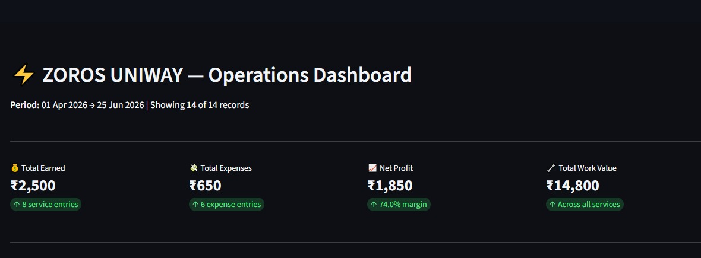
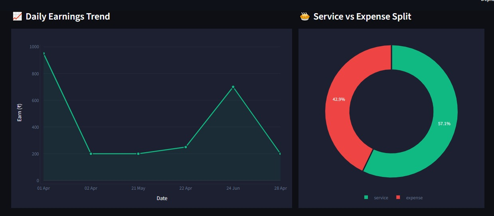
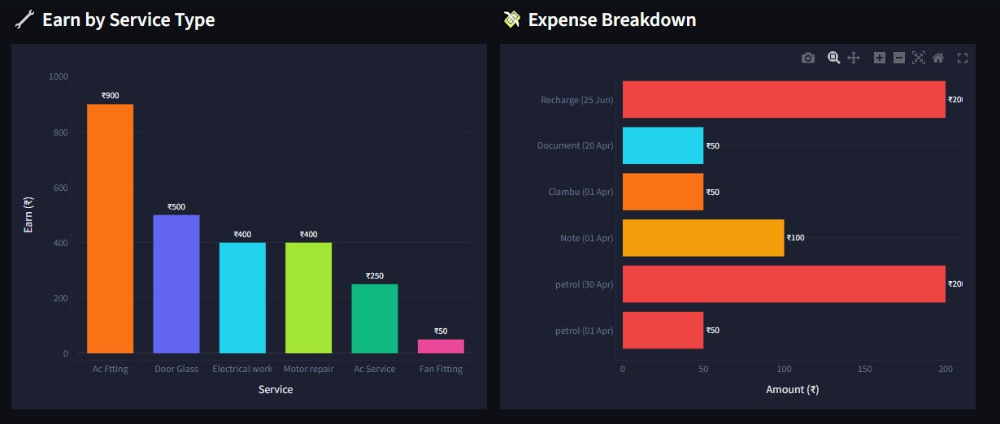
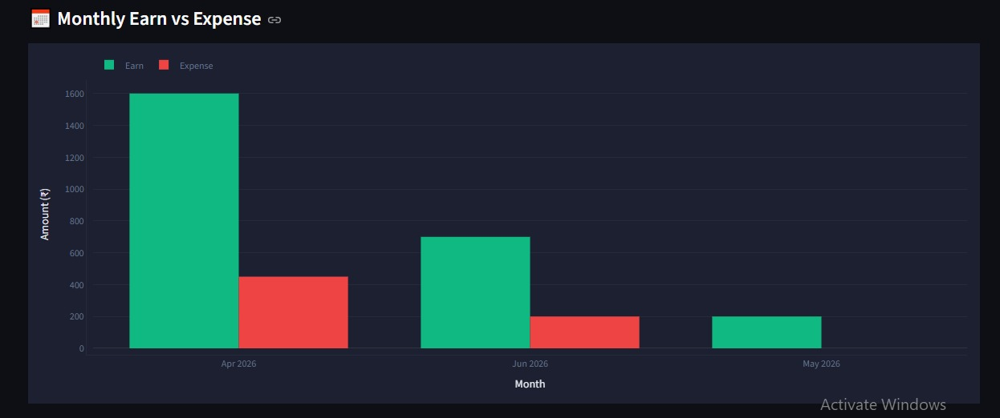

# Zoros-dashboard-
Zoros Business Dashboard is an interactive data analysis project built with Python, Pandas, and Streamlit. It processes raw business data into meaningful insights through dynamic filters and visualizations using Matplotlib and Plotly, enabling users to explore trends and support data-driven decision-making.
## 📊 Dashboard Preview

